<!-- ============================================================
     JIWON — GitHub Profile
     Design system: dark editorial · hairlines · mono labels
     All SVG assets are hand-built and live in /assets
     Dark/Light auto-switching via <picture> prefers-color-scheme
============================================================= -->

<picture>
  <source media="(prefers-color-scheme: dark)" srcset="assets/hero-dark.svg">
  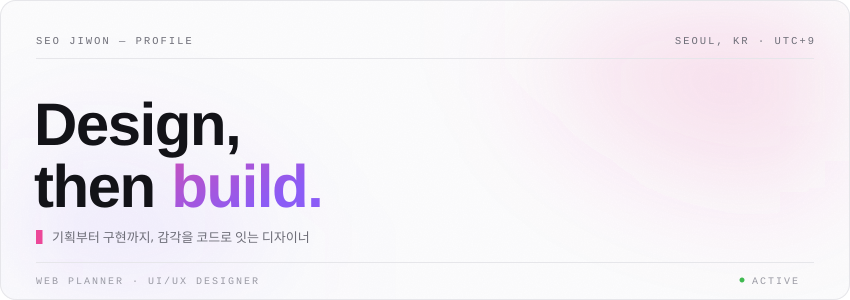
</picture>

 

<!-- ===== 01 ABOUT ===== -->

<picture>
  <source media="(prefers-color-scheme: dark)" srcset="assets/header-about-dark.svg">
  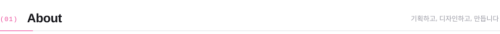
</picture>

**Web Planner & UI/UX Designer** 서지원입니다.
대담한 비주얼과 인터랙션으로 감각적인 웹 경험을 만듭니다. 화면 설계에서 멈추지 않고,
GSAP 인터랙션과 성능까지 직접 코드로 마감합니다.

**[PORTFOLIO ↗](https://jiwon12011.github.io/portfolio/)** &nbsp;·&nbsp; **[EMAIL ↗](mailto:jiwon12011@gmail.com)**

 

<!-- ===== 02 TECH STACK ===== -->

<picture>
  <source media="(prefers-color-scheme: dark)" srcset="assets/header-stack-dark.svg">
  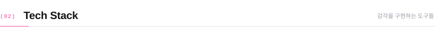
</picture>

<picture>
  <source media="(prefers-color-scheme: dark)" srcset="assets/stack-dark.svg">
  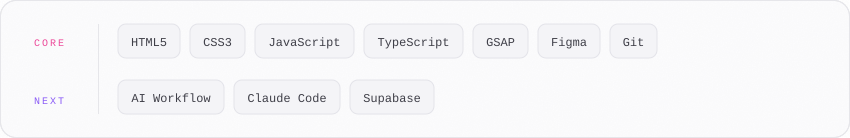
</picture>

 
 

<!-- ===== 03 FEATURED PROJECTS ===== -->

<picture>
  <source media="(prefers-color-scheme: dark)" srcset="assets/header-projects-dark.svg">
  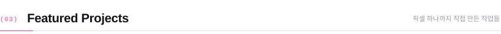
</picture>

<table width="100%">
<tr>
<td width="50%" align="center">
<a href="https://jiwon12011.github.io/portfolio/">
<picture>
  <source media="(prefers-color-scheme: dark)" srcset="assets/project-portfolio-dark.svg">
  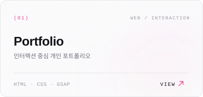
</picture>
</a>
</td>
<td width="50%" align="center">
<a href="https://1team-jaringobi.vercel.app/">
<picture>
  <source media="(prefers-color-scheme: dark)" srcset="assets/project-jaringobi-dark.svg">
  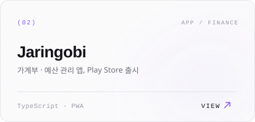
</picture>
</a>
</td>
</tr>
<tr>
<td width="50%" align="center">
<a href="https://jiwon12011.github.io/RIPE/">
<picture>
  <source media="(prefers-color-scheme: dark)" srcset="assets/project-ripe-dark.svg">
  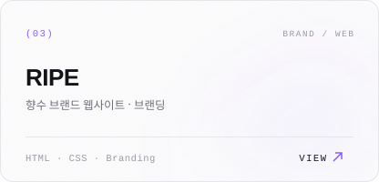
</picture>
</a>
</td>
<td width="50%" align="center">
<a href="https://jiwon12011.github.io/Yumi-s-Cells/">
<picture>
  <source media="(prefers-color-scheme: dark)" srcset="assets/project-yumi-dark.svg">
  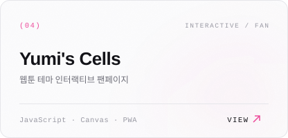
</picture>
</a>
</td>
</tr>
</table>

<b>&nbsp;MORE PROJECTS</b> — 그 외 작업들

 

| Project | About | Links |
|:--|:--|:--|
| **Hon Promotion** | 귀혼 프로모션 사이트 | [Live ↗](https://jiwon12011.github.io/hon_promotion/) · [Code](https://github.com/jiwon12011/hon_promotion) |
| **Sangsangdoor** | 상상의문 브랜드 사이트 | [Live ↗](https://jiwon12011.github.io/sangsangdoor_jw/) · [Code](https://github.com/jiwon12011/sangsangdoor_jw) |
| **Pledis** | 플레디스 엔터테인먼트 리디자인 | [Live ↗](https://jiwon12011.github.io/pledis/) · [Code](https://github.com/jiwon12011/pledis) |
| **MathHub** | 수학 학습 플랫폼 | [Live ↗](https://jiwon12011.github.io/mathhub/) · [Code](https://github.com/jiwon12011/mathhub) |
| **Pixel Game** | 인터랙티브 픽셀 게임 | [Live ↗](https://jiwon12011.github.io/pixel_game/) · [Code](https://github.com/jiwon12011/pixel_game) |
| **Music Note Game** | 음악 노트 게임 | [Live ↗](https://jiwon12011.github.io/music-note_game/) · [Code](https://github.com/jiwon12011/music-note_game) |

 

<!-- ===== 04 GITHUB STATS ===== -->

<picture>
  <source media="(prefers-color-scheme: dark)" srcset="assets/header-stats-dark.svg">
  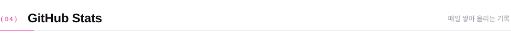
</picture>

<picture>
  <source media="(prefers-color-scheme: dark)" srcset="https://streak-stats.demolab.com?user=jiwon12011&background=0B0B0E&border=1F1F26&ring=EC4899&fire=EC4899&currStreakNum=EDEDF2&sideNums=EDEDF2&currStreakLabel=EC4899&sideLabels=8A8A96&dates=5C5C66&border_radius=14&date_format=Y.%20M%20j&disable_animations=true">
  
</picture>

<picture>
  <source media="(prefers-color-scheme: dark)" srcset="https://github-readme-activity-graph.vercel.app/graph?username=jiwon12011&bg_color=0B0B0E&color=8A8A96&line=EC4899&point=EDEDF2&area=true&area_color=EC4899&hide_border=false&border_color=1F1F26&radius=14&custom_title=Contribution%20Graph">
  
</picture>

<picture>
  <source media="(prefers-color-scheme: dark)" srcset="https://raw.githubusercontent.com/jiwon12011/jiwon12011/output/snake-dark.svg">
  
</picture>

 
 

<!-- ===== 05 AI TEAM ===== -->

<picture>
  <source media="(prefers-color-scheme: dark)" srcset="assets/header-team-dark.svg">
  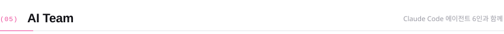
</picture>

Claude Code 기반 **6인 AI 에이전트 팀**과 함께 기획부터 구현까지 진행합니다.

<picture>
  <source media="(prefers-color-scheme: dark)" srcset="assets/team-dark.svg">
  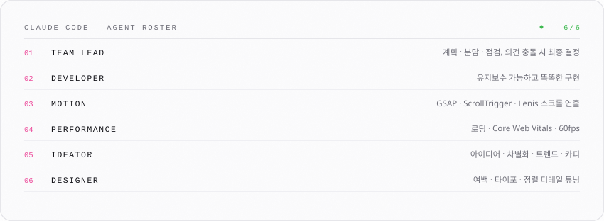
</picture>

 

<picture>
  <source media="(prefers-color-scheme: dark)" srcset="assets/footer-dark.svg">
  
</picture>

